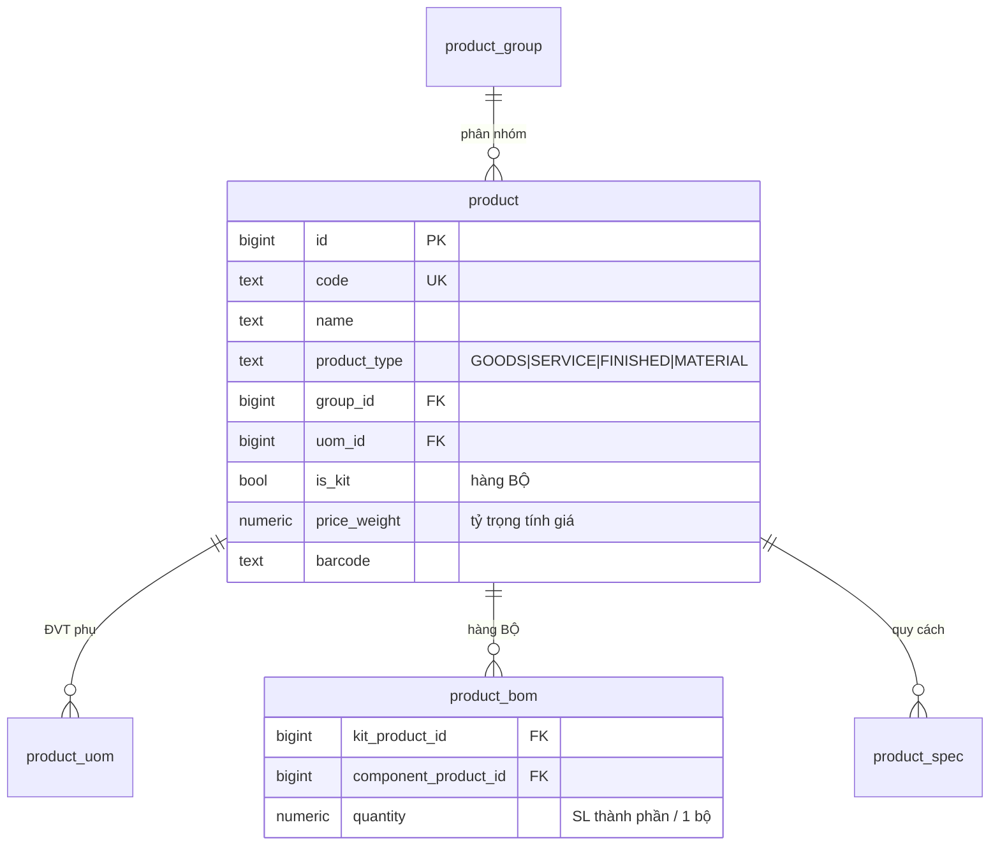
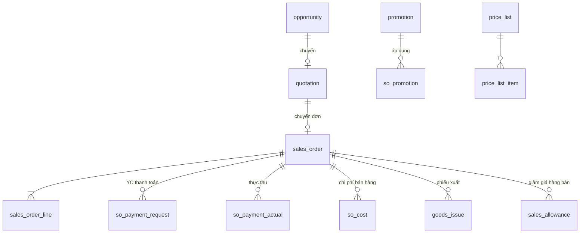
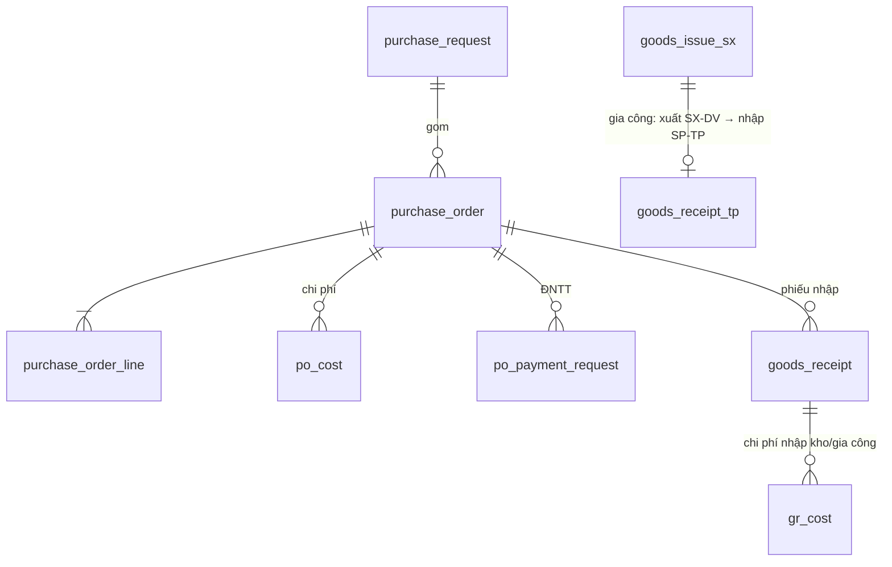
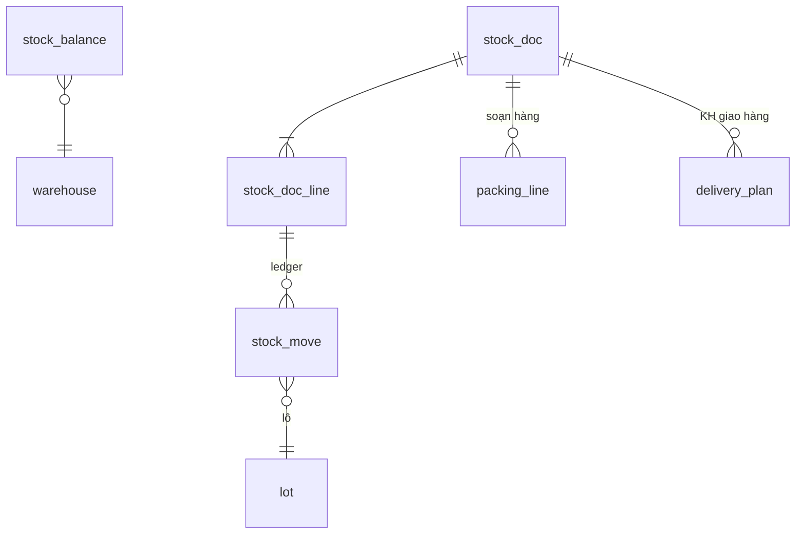
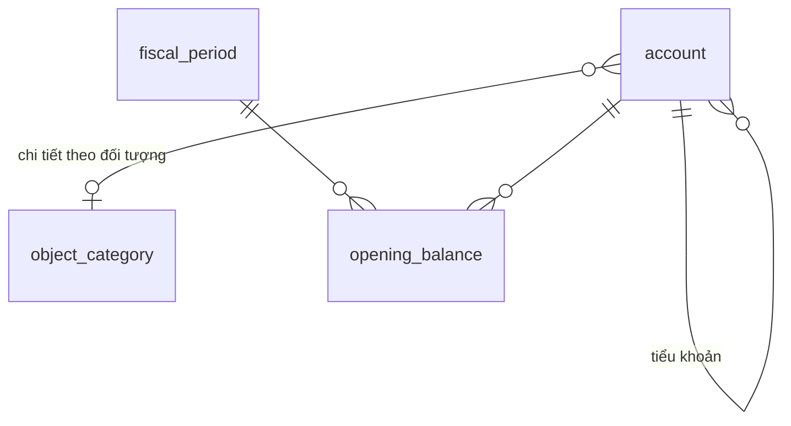
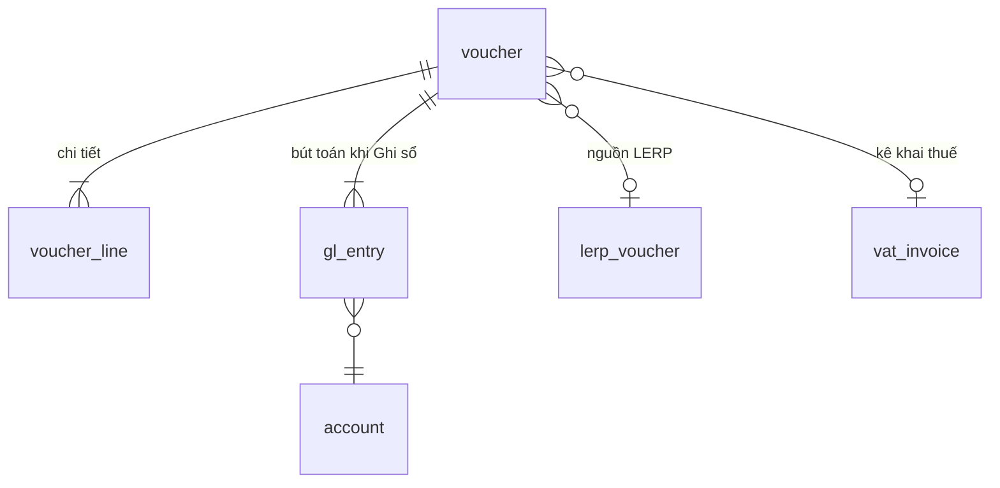

# DATA MODEL — Hệ thống ERP (PostgreSQL)

> Đi kèm [`system_design.md`](./system_design.md). DDL đầy đủ: [`data_model.sql`](./data_model.sql).
> Tổ chức theo schema: `core`, `sales`, `purchasing`, `inventory`, `finance`.

## Quy ước

- PK: `id BIGINT GENERATED ALWAYS AS IDENTITY`; mã nghiệp vụ: `code`/`doc_no` UNIQUE.
- Audit chung: `created_by, created_at, updated_by, updated_at`; soft-delete: `is_active` / `deleted_at`.
- Tiền: `NUMERIC(18,2)`; số lượng/tỷ giá: `NUMERIC(18,4)`; đa tiền tệ lưu `currency_code, exchange_rate, amount_fc, amount` (quy đổi).
- Trạng thái chứng từ: cột `status` kiểu TEXT + CHECK, log chuyển trạng thái ở `core.wf_transition_log`.

---

## 1. CORE — Danh mục, tổ chức, phân quyền

### 1.1. Người dùng & phân quyền

| Bảng | Mô tả |
|---|---|
| `core.app_user` | Người dùng (username, password_hash, employee_id, is_admin) |
| `core.user_group` / `core.user_group_member` | Nhóm người dùng |
| `core.permission` | Quyền: subject_type (FUNCTION/CATALOG/DOCUMENT/OPERATION/REPORT), subject_code, action (VIEW/CREATE/UPDATE/DELETE/APPROVE/POST/UNLOCK), grantee (user/group) |
| `core.data_scope` | Phân quyền dữ liệu theo cơ cấu tổ chức (user ↔ department) |
| `core.approval_right` | Phân quyền phê duyệt theo loại chứng từ |

### 1.2. Tổ chức – nhân viên

`core.department` (cây), `core.job_title`, `core.work_position`, `core.employee` (mã NV, họ tên, bộ phận, chức danh, SĐT, email, lương–BH cơ bản).

### 1.3. Danh mục chung

`core.uom`, `core.uom_conversion`, `core.currency`, `core.exchange_rate`, `core.country/province/district`, `core.payment_method` (kèm `due_days` để tự sinh YC thanh toán), `core.delivery_method`, `core.cost_type` (loại chi phí: vận chuyển, hoa hồng, gia công…), `core.process` (quy trình gia công: XI / NHUNG_NONG / TARO_TAN), `core.doc_numbering` (mẫu đánh số phiếu).

### 1.4. Hàng hóa – Dịch vụ

### 1.5. Đối tác (Khách hàng / Nhà cung cấp)

Một bảng `core.partner` với 2 cờ `is_customer`, `is_supplier` (tài liệu: KH có thể tick NCC và ngược lại).

| Bảng | Nội dung chính |
|---|---|
| `core.partner` | code, tax_code, short_name, full_name, nhóm KH, nguồn, xếp hạng, địa chỉ, phone/hotline/fax/email/website, PTTT & PT giao hàng mặc định, NV phụ trách, `credit_limit`, `credit_days`, is_customer, is_supplier |
| `core.partner_contact` | Danh sách người liên hệ |
| `core.partner_address` | Địa chỉ giao dịch / giao hàng |
| `core.partner_bank_account` | TK thanh toán NCC |
| `core.partner_sales_cost` | Chi phí bán hàng mặc định theo KH (loại chi phí, đối tượng NCC, tỷ lệ %, VAT %) |

### 1.6. Kho & workflow

`core.warehouse` (kho, cờ kho gia công), `core.warehouse_location` (vị trí lưu kho), `core.attachment` (đính kèm đa chứng từ), `core.task` / `core.note` (công việc, ghi chú), `core.wf_transition_log`, `core.audit_log`.

---

## 2. SALES — Bán hàng & CRM

| Bảng | Nội dung chính |
|---|---|
| `sales.opportunity` | Cơ hội: KH, giá trị dự kiến, giai đoạn, NV phụ trách |
| `sales.price_list` / `price_list_item` | Hình thức áp giá, hiệu lực từ/đến; mặt hàng + giá quy định |
| `sales.promotion` | Chương trình KM-CK: tên, nhóm, ngày BĐ/KT, công ty hỗ trợ, tỷ lệ CK, có tặng thưởng |
| `sales.promotion_discount_item` | Hàng chiết khấu: tổng tỷ lệ, tỷ lệ công ty, tỷ lệ hãng |
| `sales.promotion_gift_item` | Hàng tặng: hàng mua, hàng tặng, SL yêu cầu mua, tổng SL tặng, SL công ty/hãng tặng |
| `sales.sales_target` | Chỉ tiêu bán hàng theo NV/kỳ |
| `sales.quotation` | Báo giá: số YCBG, người lập/duyệt/YC báo giá, bộ phận, KH + người liên hệ + ĐC giao, loại (NORMAL/PROJECT), hình thức (NORMAL/ESTIMATE), thời hạn báo giá, giao hàng từ-đến, PTTT/PTGH, TK thanh toán, dịch vụ đính kèm, **status**: NEW → PRICE_REQUESTED → PRICING → APPROVAL_REQUESTED → APPROVED → ORDER_PENDING / FAILED / CANCELLED / ORDERED / REJECTED (+ lý do) |
| `sales.quotation_line` | Mã hàng, dự án–nhà, SL, VAT, giá tính, **giá duyệt**, tỷ trọng, ghi chú |
| `sales.quotation_cost` | Chi phí theo báo giá (đối tượng, tỷ lệ %, VAT) |
| `sales.pricing_formula` | Thiết lập công thức tính giá mặc định theo nhóm hàng/mã hàng |
| `sales.sales_order` | Đơn hàng bán: từ báo giá hoặc trực tiếp, hình thức (NORMAL/GIFT), kênh bán, vùng bán hàng, kho bán hàng, ngày giao (KH), **status**: DRAFT → APPROVAL_REQUESTED → APPROVED → NOT_DELIVERED → DELIVERED → COMPLETED / CANCELLED |
| `sales.sales_order_line` | Mã hàng, SL, **SL bộ**, đơn giá, VAT %, thành tiền, giá quy định (từ bảng giá) |
| `sales.so_promotion` | KM-CK áp cho đơn (tham chiếu promotion) |
| `sales.so_payment_request` | YC thanh toán (tự sinh theo PTTT.due_days), hạn TT, số tiền, trạng thái |
| `sales.so_payment_actual` | Thực tế thanh toán |
| `sales.so_cost` | Chi phí theo đơn (loại, đối tượng, tỷ lệ/mức phí, VAT, hạn TT, `approved` → đẩy PGC) |
| `sales.sales_allowance` (+`_line`) | Giảm giá hàng bán: hình thức (GIẢM_TRỪ_CÔNG_NỢ / TRẢ_TIỀN_MẶT), SL giảm, đơn giá giảm, duyệt |
| *Nhật ký bán hàng* | View trên `core.wf_transition_log` + `core.audit_log` (lọc chứng từ sales) |

---

## 3. PURCHASING — Mua hàng & Gia công

| Bảng | Nội dung chính |
|---|---|
| `purchasing.purchase_request` (+`_line`) | Yêu cầu mua hàng nội bộ |
| `purchasing.purchase_order` | Đơn hàng mua: NCC, ngày đặt/nhận (KH), hình thức (**NORMAL / SERVICE / OUTSOURCING**), PTTT/PT giao nhận, ĐC nhận, cờ VAT, **status**: DRAFT → APPROVED → NOT_RECEIVED → RECEIVED → COMPLETED / CANCELLED |
| `purchasing.purchase_order_line` | Mã hàng, SL, đơn giá, VAT, thành tiền |
| `purchasing.po_cost` | Chi phí đơn mua: **số phiếu nhập tham chiếu** (bắt buộc trước khi duyệt để phân bổ), loại chi phí, NCC dịch vụ, mức phí, VAT, PTTT, `approved` |
| `purchasing.po_payment_request` | Đề nghị thanh toán (nhiều đợt): số tiền, hạn, **status**: DRAFT → APPROVED (→ sinh LERP-YCC) |
| `purchasing.po_payment_actual` | Thực tế thanh toán |
| `purchasing.supplier_return` (+`_line`) | Trả hàng NCC |
| `purchasing.outsourcing_cost` | Chi phí gia công theo mã hàng (đối tượng, loại CP, VAT, loại tiền, tỷ giá, PTTT, **quy trình**) — gắn vào phiếu nhập SP-TP; được "tập hợp" thành PO dịch vụ (`collected_po_id`) |
| *Nhật ký mua hàng* | View trên `core.wf_transition_log` + `core.audit_log` (lọc chứng từ purchasing) |

---

## 4. INVENTORY — Kho vận

| Bảng | Nội dung chính |
|---|---|
| `inventory.stock_doc` | Chứng từ kho hợp nhất: `doc_type` (RECEIPT/ISSUE/TRANSFER), `sub_type` — nhập: PURCHASE, CUSTOMER_RETURN, FINISHED_GOODS (SP-TP), OTHER, CODE_ADJUST; xuất: SALES, OUTSOURCING (SX-DV), SUPPLIER_RETURN, OTHER, CODE_ADJUST; tham chiếu SO/PO, kho xuất/nhập, **mã đối tượng**, đơn vị xuất/nhận (BỘ PHẬN GIA CÔNG), **quy trình gia công**, phiếu đối ứng (`counterpart_doc_id` cho điều chỉnh mã & cặp gia công); **status**: DRAFT → REQUESTED → CONFIRMED → COMPLETED / CANCELLED; ngày yêu cầu/ngày thực tế |
| `inventory.stock_doc_line` | Mã hàng, SL yêu cầu, **SL thực tế**, SL bộ, đơn giá, lô, ngày hết hạn, vị trí kho |
| `inventory.lot` | Mã lô, hàng hóa, ngày hết hạn |
| `inventory.stock_move` | Ledger nhập/xuất: hàng, kho, lô, vị trí, +/- SL, đơn giá vốn, tham chiếu chứng từ — nguồn tính tồn & thẻ kho |
| `inventory.stock_balance` | Tồn hiện thời theo (kho, hàng, lô) — cập nhật từ stock_move |
| `inventory.gr_cost` | Chi phí nhập kho (gia công…): loại CP, NCC dịch vụ, số tiền, VAT, quy trình, `approved` → PGC |
| `inventory.packing_line` | Đóng gói – soạn hàng: số con/bao, số bao, số con lẻ, người thực hiện, hoàn thành |
| `inventory.delivery_plan` | Kế hoạch giao hàng theo phiếu xuất |
| *Nhật ký kho / thẻ kho* | View trên `inventory.stock_move` + `core.wf_transition_log` |

---

## 5. INTEGRATION — Cầu nối LERP

| Bảng | Nội dung chính |
|---|---|
| `finance.outbox_event` | Transactional outbox: event_type, source_table/id, payload JSONB, processed_at |
| `finance.lerp_voucher` | Phiếu LERP: `voucher_type` (YCT, YCC, BAN_HANG, HANG_TRA_LAI, PHIEU_XUAT, MUA_HANG, PHIEU_NHAP, TRA_HANG_NCC, XUAT_KHO, NHAP_KHO, CHUYEN_KHO, PGC), tham chiếu chứng từ nguồn SCRM, **status**: PENDING (chưa tạo phiếu) → GENERATED (đã tạo phiếu) → POSTED (đã ghi sổ) / DELETED; FK tới chứng từ kế toán đích `finance.voucher.id` |

---

## 6. FINANCE — Kế toán

### 6.1. Hệ thống tài khoản & kỳ

| Bảng | Nội dung chính |
|---|---|
| `finance.account` | Số hiệu, tên, parent_id (cây), loại TK (tài sản/nguồn vốn/DT/CP/ngoài bảng), `object_category_id` (chi tiết PS theo đối tượng), `balance_detail` (NONE / OBJECT / OBJECT_FX / OBJECT_QTY — đối tượng/ngoại tệ/số lượng), `balance_side` (NONE/DEBIT/CREDIT/GREATER/BOTH) |
| `finance.object_category` | Danh mục đối tượng quản lý (KH, NCC, nhân viên, thẻ TSCĐ, thẻ CPPB, quỹ…) — mở rộng được |
| `finance.fiscal_period` | Kỳ hạch toán (năm/tháng, trạng thái OPEN/CLOSED) |
| `finance.opening_balance` | Số dư đầu kỳ: TK, đối tượng, tiền tệ, kho, dư Nợ/Có nguyên tệ + quy đổi, SL |
| `finance.accounting_policy` | Chính sách kế toán (chế độ, kỳ khóa sổ, PP giá xuất kho, tùy chọn hệ thống) |
| `finance.business_operation` | Danh mục **Nghiệp vụ**: mẫu định khoản sẵn (TK Nợ/Có mặc định) cho từng loại phiếu |

### 6.2. Chứng từ & bút toán

| Bảng | Nội dung chính |
|---|---|
| `finance.voucher` | Chứng từ hợp nhất: `voucher_type` (PHIEU_THU, PHIEU_CHI, CHUYEN_TIEN, YEU_CAU_CHI, YEU_CAU_THU, HOA_DON_BAN, HANG_BAN_TRA_LAI, PHIEU_GHI_NO, PHIEU_MUA_HANG, TRA_HANG_NCC, PHIEU_GHI_CO, PHIEU_XUAT_KT, PHIEU_NHAP_KT, DIEU_CHUYEN_KT, CT_GIAM_GIA, CT_TONG_HOP…), số CT, ngày lập/hạch toán, đối tượng, nghiệp vụ, quỹ tiền, kho, loại YCC, hóa đơn (số/ký hiệu/ngày), tiền tệ + tỷ giá, **status**: DRAFT → APPROVED → POSTED → UNLOCKED |
| `finance.voucher_line` | Dòng chi tiết: hàng hóa/diễn giải, SL, đơn giá, tiền, VAT, TK Nợ/Có override, đối tượng Nợ/Có, chứng từ thanh toán tham chiếu |
| `finance.gl_entry` | Sổ cái (immutable khi POSTED): ngày HT, kỳ, TK, Nợ/Có, đối tượng, tiền tệ, nguyên tệ + quy đổi, SL + kho + lô, voucher_id — partition theo kỳ |
| `finance.cash_fund` | Quỹ tiền mặt / TK ngân hàng |
| `finance.bank_fee` | Phí ngân hàng kèm phiếu chuyển tiền |

### 6.3. TSCĐ / CCDC / Chi phí phân bổ

| Bảng | Nội dung chính |
|---|---|
| `finance.fixed_asset` | Mã, tên, phân nhóm (cặp TK nguyên giá–khấu hao), bộ phận, ngày bắt đầu SD, cờ `is_tool` (CCDC), ĐVHT |
| `finance.asset_card` | Thẻ tài sản |
| `finance.asset_report` | Biên bản: ngày, loại (tăng/giảm/điều chỉnh), nghiệp vụ TSCĐ, **PP khấu hao** (STRAIGHT_LINE / DECLINING / OUTPUT / WEAR / NONE), mốc bắt đầu KH (đầu kỳ/ngày BB/đầu kỳ sau), nguyên giá, thời gian SD còn lại (tháng), KH bình quân tháng |
| `finance.asset_alloc_rule` | Bút toán phân bổ KH: TK phân bổ, đối tượng, **hệ số** (tỷ lệ = hệ số/tổng hệ số), áp dụng kỳ này/kỳ sau |
| `finance.depreciation_entry` | Kết quả trích KH theo kỳ (liên kết voucher) |
| `finance.prepaid_expense` | Danh mục chi phí phân bổ (TK 2421, loại thẻ Chi phí) |
| `finance.prepaid_card` | Thẻ CPPB: nguồn (số PS/số dư), PP phân bổ (thời gian/sản lượng), thời gian SD/PB |
| `finance.prepaid_alloc_rule` / `finance.prepaid_alloc_entry` | Quy tắc & kết quả phân bổ theo kỳ |

### 6.4. Thuế, giá thành, cuối kỳ

| Bảng | Nội dung chính |
|---|---|
| `finance.vat_invoice` | Hóa đơn mua vào/bán ra: hướng (IN/OUT), số/ký hiệu/mẫu số/ngày, đối tác, MST, giá trị trước thuế, thuế suất, tiền thuế, kỳ kê khai, voucher_id; UNIQUE chống trùng |
| `finance.vat_deduction` | Bút toán khấu trừ GTGT theo kỳ |
| `finance.cit_declaration` | Tờ khai thuế TNDN (tạm tính/quyết toán) |
| `finance.costing_object` | Đối tượng tính giá thành theo **quy trình gia công**; tập hợp chi phí & giá thành SP-TP |
| `finance.period_closing` | Nghiệp vụ cuối kỳ: khấu hao, phân bổ, tính lại giá xuất, lãi/lỗ tỷ giá, phân bổ CP mua hàng cho hàng tiêu thụ, kết chuyển — trạng thái từng bước theo kỳ |

---

## 7. Quan hệ liên-module chính

| Từ | Đến | Ý nghĩa |
|---|---|---|
| `sales.quotation` → `sales.sales_order` | 1-1 | Chuyển báo giá thành đơn; hủy đơn → báo giá FAILED |
| `sales.sales_order` → `inventory.stock_doc` | 1-n | YC xuất kho (xuất nhiều lần) |
| `purchasing.purchase_order` → `inventory.stock_doc` | 1-n | YC nhập kho |
| `inventory.stock_doc` (hoàn tất) → `finance.lerp_voucher` | 1-1 | Đẩy sang kế toán |
| `*.cost.approved` → `finance.lerp_voucher(PGC)` | 1-n | Duyệt chi phí → Phiếu ghi Có |
| `finance.lerp_voucher` → `finance.voucher` → `finance.gl_entry` | | Phát sinh phiếu → Ghi sổ |
| `inventory.stock_doc(OUTSOURCING)` ↔ `inventory.stock_doc(FINISHED_GOODS)` | cặp | Xuất SX-DV ↔ Nhập SP-TP cùng quy trình |
| `inventory.stock_doc(CODE_ADJUST xuất)` ↔ `(CODE_ADJUST nhập)` | cặp | Điều chỉnh mã A → B |
